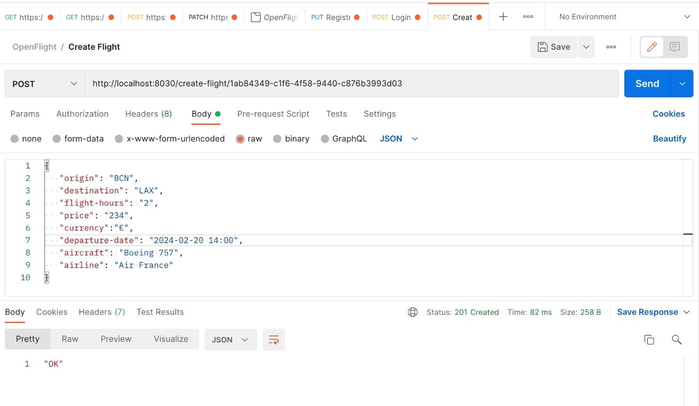

## 🚀 Environment Setup

### 🐳 Needed tools

1. [Install Docker](https://www.docker.com/get-started)
2. Clone this project: `git@github.com:lucianogarciaz/mpwar.git`
3. Move to the project folder: `cd mpwar`

### 🔥 Application execution

1. Run docker compose: `docker-compose up -d`
2. Install all the dependencies and bring up the project with Docker executing: `make build`
3. `make start-service`
4. Then you'll have:
   1. [health-check](apps/openflight/backend/src/Controller/Healthcheck): http://localhost:8030/health-check
   2. PUT [register-user](apps/openflight/backend/src/Controller/Users): http://localhost:8030/register-user/e617f839-c8ee-4580-a0d3-6dceab0f3293 + body


### Add a new endpoint

1. Create a controller that will receive the request inside [controller](apps/openflight/backend/src/Controller)
2. Create the route in [routes](apps/openflight/backend/config/routes)

## Enunciado Practico NRO 1

1. Deben clonar este proyecto y luego subirlo a un repositorio privado de cada grupo
2. El nombre del proyecto mpwar-openflight-g{nro}
3. Deben dar acceso al usuario lucianogarciaz
4. Para entregar el práctico debe ser un pull request contra la rama `master` con fecha máxima 28-04-2021x

### Enunciado

Ya que tenemos el `/register-user`, ahora debemos poder loguearnos.
Por lo tanto se pide implementar el caso de uso `Login`
El mismo será una petición http `POST` al endpoint `/login` y el body será de la siguiente manera
```json
{
   "username": "lucianogarciaz",
   "password": "pwned_password"
}
```

#### Negocio nos pide
* Si el usuario no puede loguearse (por que su password es incorrecto, o no existe en la base de datos) deberá devolver
  "Incorrect credentials".

### Mínimos requisitos para aprobar
* Cumplir con la regla de dependencias

#### NOTA: Agregar todos los métodos, clases o interfaces que crea que haga falta.

## Enunciado Practico NRO 2

Ya tenemos los usuarios creados y se pueden loguear en nuestro sistema
Ahora queremos poder crear un vuelo
El vuelo tiene que tener una localidad de origen y otra final
El mismo será una petición http `POST` al endpoint `/create-flight` y el body será de la siguiente manera
```json
{
   "id": "00e71601-d7ad-492f-b703-4160e622c55e",
   "origin": "BCN",
   "destination": "LAX",
   "flight-hours": "2",
   "price": "234",
   "currency":"€",
   "departure-date": "2020-02-20 14:00",
   "aircraft": "Boeing 757",
   "airline": "Air France"
}
```
Restricciones:
* El aeropuerto debe ser válido
* El aeropuerto de partida debe ser distinto al de llegada
* Las horas de vuelo deben ser mayores a 1.
* Las currencies que aceptamos son dolares, libras y euros ($, £, €)
* La fecha de partida debe ser mayor a la fecha actual
* El vuelo debe ser creado con éxito (response status: 200)

Resultado final - Práctica 2




## Enunciado Práctico Nro 3
Ya tenemos los usuarios creados, y se pueden loguear. Desde nuestro backoffice podemos crear un vuelo.
El nuevo paso que debemos dar es que un usuario pueda reservar un vuelo.
Aquí tener en cuenta:
* Asiento
* Clase
* Precio
* ...?


El práctico 3 tiene dos partes.
* La primera parte consiste en diseñar el agregado y debatirlo con el docente.
* La segunda parte consiste en implementar el diseño del agregado.


## Enunciado Práctico Nro 4
Ahora que vimos lo que son los eventos de dominio, pues tienen que implementar eventos de dominios en sus casos de uso!

## Enunciado Práctico Nro 5
Este práctico consiste en modificar las llamadas que teniamos desde el controlador al caso de uso utilizando el patrón
CQS!
